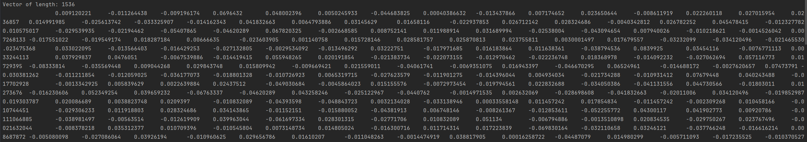
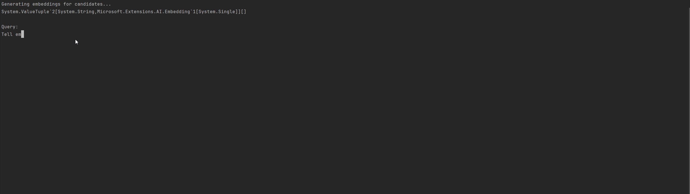
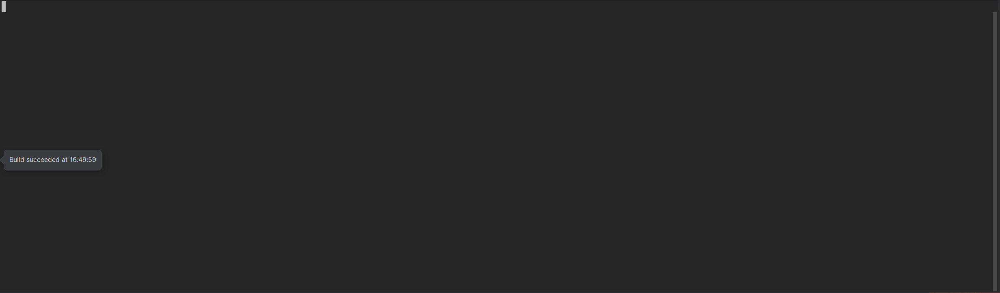
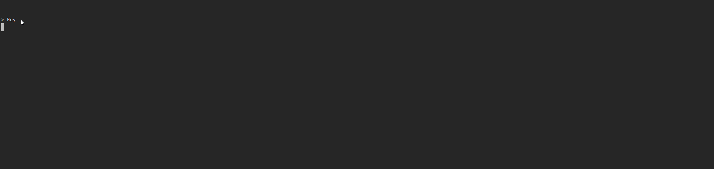
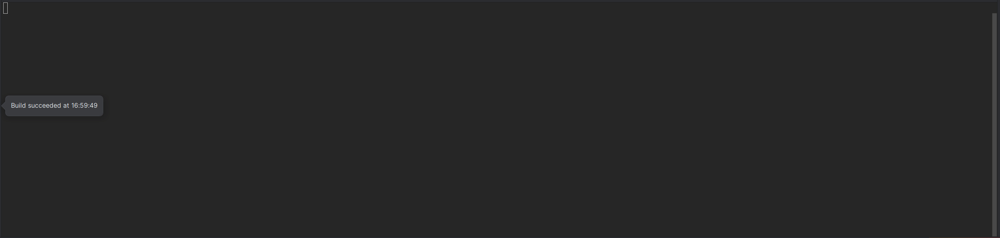
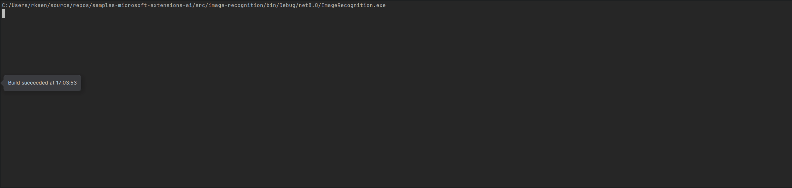

# Microsoft.Extensions.AI samples

I am going to work through the features of the new Microsoft.Extensions.AI library

## Installation

1. Clone the repository

## Prerequisites

- LLM api key and model (I used OpenAI)

## Embeddings

This feature contains two basic console app samples

*Sample 1:* Uses OpenAI's embedding model to generate vectors and displays them in the console



*Sample 2:* Generates embeddings and then queries the embeddings, returning the top 3 results in similarity



## Simple Chat

This feature is a simple console app with a hard coded query to OpenAI



## Chat with Functions

This feature builds on the *Simple Chat* feature and illustrates the ability to add logic to your AI assistant.



- Some things have been updated for the function to work:
    - Removed the following lines of code for the AI set up
      ```
      var hostBuilder = Host.CreateApplicationBuilder(args);
      hostBuilder.Configuration.AddEnvironmentVariables("OPENAI_API_KEY");
      hostBuilder.Services.AddSingleton<IChatClient>(innerChatClient);

      hostBuilder.Services.AddLogging(builder => builder
          .AddConsole()
          .SetMinimumLevel(LogLevel.Trace));

      var app = hostBuilder.Build();
      var chatClient = app.Services.GetRequiredService<IChatClient>();
      ```
    - Instead, I added:
      ```
      var chatClientBuilder = new ChatClientBuilder(innerChatClient).UseFunctionInvocation();

      IChatClient client = chatClientBuilder.Build();
      ```
      - These lines add the ability to call the functions
      - Other code was added for prompts and a method that holds the functions being called

## Image Recognition

This feature shows how AI can view an image and understand what's in the picture.

*Sample 1:* Shows the ability to summarize what's in an image



*Sample 2:* Iterates over multiple images and outputs what's in the image based on an object provided. 
            There are two examples objects shown, the first TrafficCamResults was the example from a tutorial, I then added in AnimalsResult for further testing. 

**Traffic Results**



**Animal Results**


## References
- https://www.youtube.com/watch?v=qcp6ufe_XYo
- https://www.nuget.org/packages/Microsoft.Extensions.AI.OpenAI/9.0.0-preview.9.24556.5
- https://github.com/lucavgobbi/MicrosoftExtensionsAIDemo/blob/main/Program.cs